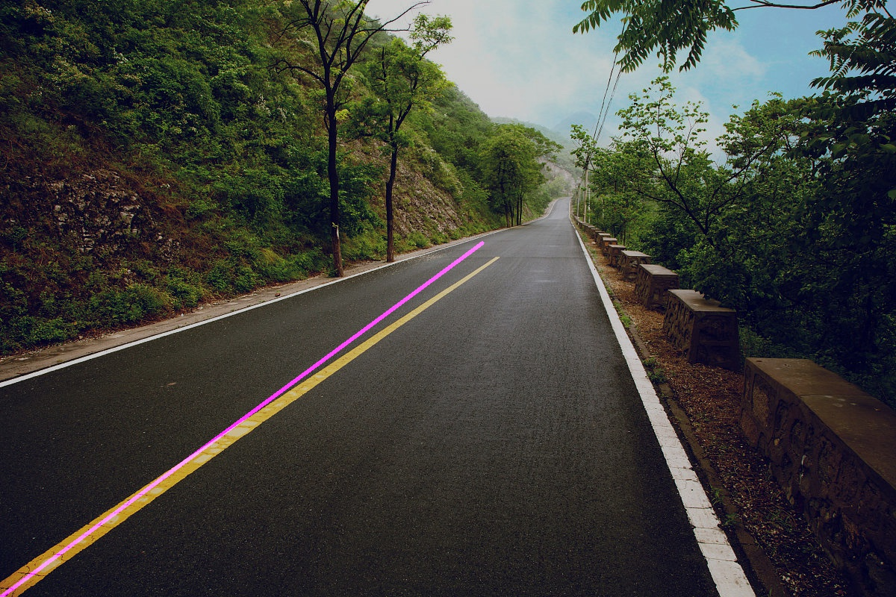
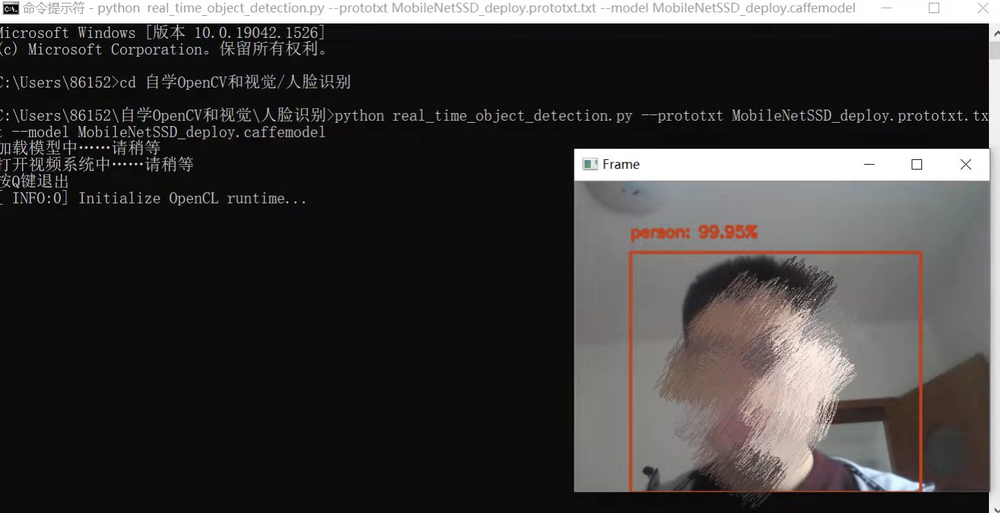
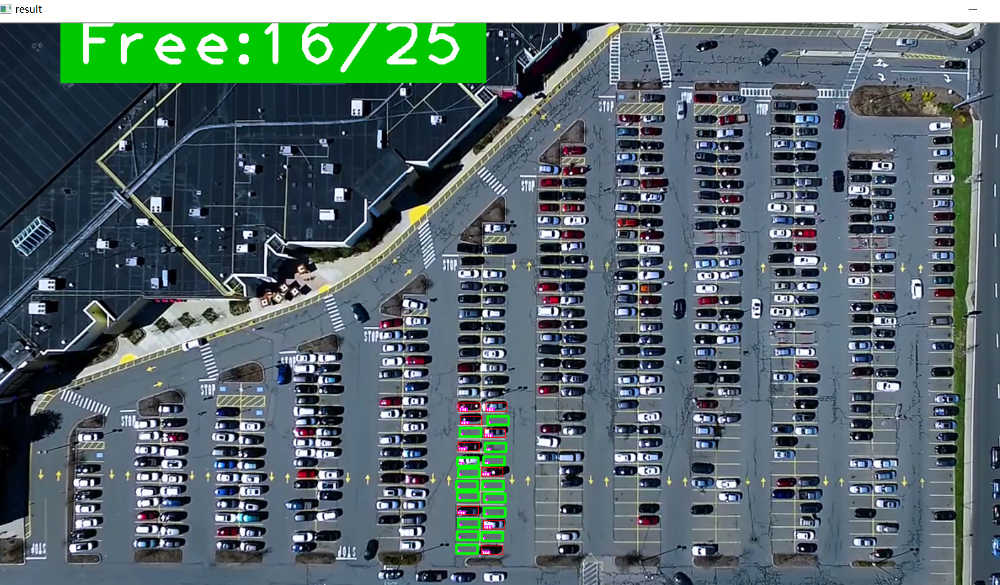

# 深度学习和计算机视觉在驾驶中的应用

## 概述

对生活场景中的驾驶有感，本想只做深度学习在驾驶中的运用，后来还是决定循序渐进，先主要用了OpenCV做一些传统方式（处理图像，利用计算机视觉方法捕捉识别目标的特征并展示）的视觉应用，后面又做了两个深度学习的应用。  

做了4个应用方向，想运行哪一个应用方向就下载哪个文件夹，打开文件夹后在其中运行，还要下载Python和OpenCV（版本不能太新，因为新版本OpenCV有一些专利函数不能免费使用），具体来讲各个应用方向运行的条件都有不同，在注释中都有详细的解释。  

### 一、主要利用OpenCV的传统方法的应用
这个模块，我做了两个应用方向，分别在“检测车道”和“车牌号提取”文件夹中。   

两个应用都是对文件夹中的图片进行处理（实际生活中需处理视频，事实上也是把视频流转换为一帧又一帧的图）   

对图像的初步处理，两个应用的大致思路是相似的，但在具体操作和参数设置上有很多不同，这些步骤设计和参数选择是我在不断实践中总结的一套比较合适的方法。  

后面就是我根据实际需求设置方法和参数提取图像中我想得到的特征部位并做进一步处理，车牌号提取应用中还涉及图片字符和已有模板的匹配识别（模板取自网上做好的，是上万张模板图片）  

***需要注意的是***  
运行这两个应用需要计算机中下载了OpenCV较老版本（因为新版本OpenCV有一些专利函数不能免费使用）。  

为了避免使用者的计算机不能运行无法查看结果，我在jupyter中写了一份展示文件（运行展示.ipynb)，就在文件夹（检测车道）中就能找到。   

你们可以直接看这两个应用的jupyter文档（源代码我也提供），里面有对这个应用的介绍，代码（为了展示效果，我在最后展示图片的plt在源码基础上有修改）和运行结果展示（有的我做了重要步骤所得结果的展示）   

如果想尝试运行这两个应用，需要打开我提供的“检测车道”or“车牌号提取”文件夹，再运行程序。  

下面分别介绍这两个应用：  
#### 1.检测车道
这个应用做的比较简单，只能算小试牛刀。目的是在提供的图片中识别出车道线，并用蓝色线条描绘标注。  
项目也有明显的缺陷，比如难以精准识别曲线车道，让我体会到了基于对图像特征信息提取的传统方式的不足。  
运行结果如下：  

  

*具体介绍和展示见对应文件夹中的（运行展示.ipynb*）
#### 2.车牌号提取
这个是我花费精力较多一点的项目，分三个步骤对应三个代码文件，主要是我基于自己对OpenCV的学习研究出的一套可行方法，其中做的处理较多，主要是使用常见的方法做一步步处理。我打算还要做一个调用特殊工具包方法简易处理图像识别车牌号的小项目（代码量会比这个少，简易） ***（更正，这个小项目已经完成，就在文件夹车牌号（简易版）之中，比较简单且注释较详细所以这里就不再详细介绍）***        
这个项目有三个代码文件，需要从（step1.py）开始依次运行。  

*具体介绍和展示见对应文件夹中的（运行展示.ipynb）*
### 二、深度学习的应用
这里我也做了两个应用方向，分别是“人脸识别”和“车位识别”，除了提供源代码和处理视频之外，我还提供了我运行结果的截图。  
这两个应用方向是对视频进行操作的。    
两个深度学习应用参考网上一些大佬的源码较多，对他们进行了一定的修改和应用。
源代码文件的注释中有对项目的解释和步骤的解释、运行的方法。

***需要注意的是***  
运行这两个应用同样需要计算机中下载了OpenCV较老版本（因为新版本OpenCV有一些专利函数不能免费使用）。  
如果难以运行可以直接看我提供的运行结果截图    
   
#### 1.人脸识别
人脸识别好像和驾驶没啥关系？ 

其实我是想做一个汽车中能进行人脸识别，如果汽车长期不驾驶且识别到车内长期没有人脸，汽车系统可以自动关闭车内的灯等用电项目（防止有人下车后忘记关灯过度耗电）  

因为真正投入使用需要在完成人脸识别的基础上和汽车系统相连接，我目前没有条件实现那一步，仅仅是利用计算机的摄像头导入训练好的模型进行人脸识别   

源代码在文件夹（人脸识别）中，里面的注释也讲了运行程序的流程和方法，我的结果展示在该文件夹下的（运行结果.png)  
运行结果如下：    

  

***注意：***
该程序的运行方法在开头的注释中有介绍  

#### 2.车位识别
这个应用方向主要是对停车场车位的识别（对俯瞰停车场的视频进行操作），判断这个车位是否被占据并统计总的车位数量，占据的车位数量。  

文件夹（车位识别）中有操作的原视频，是网上相关教程中的实例视频。 

运行结果是处理后的视频，可按Q键退出或播放完成后自动退出。在文件夹（./车位识别./result_img）中有这个视频的几个截图。  

该程序还有一些不足，例如只能识别中心区域的车位，只能算是半成品，以后会继续做下去。
运行结果的一个截屏图片如下：  

  

## 总结感悟
做了好几个应用方向之后，进一步体会到了传统方式和深度学习方式的差距。传统方式我主要就是自己实验后就能摸索出一套方法，通过思考图像特征和引入模板也能基本完成任务，但是有时可能不那么精确。  
深度学习的应用方向中我更多的是参考了一些大佬的代码后进行修改，难度相对大一些，但是做的好效果真的靠谱得多。
